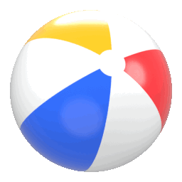

# Forever

A spinning beach ball that keeps bouncing in the macOS Dock. Built with Swift, SwiftUI, and AppKit. No dependencies.

## Artwork

The Blender model and texture are in `art/`. Edit `beachball.blend`, run `./scripts/export.sh`, then rebuild the app in Xcode.
